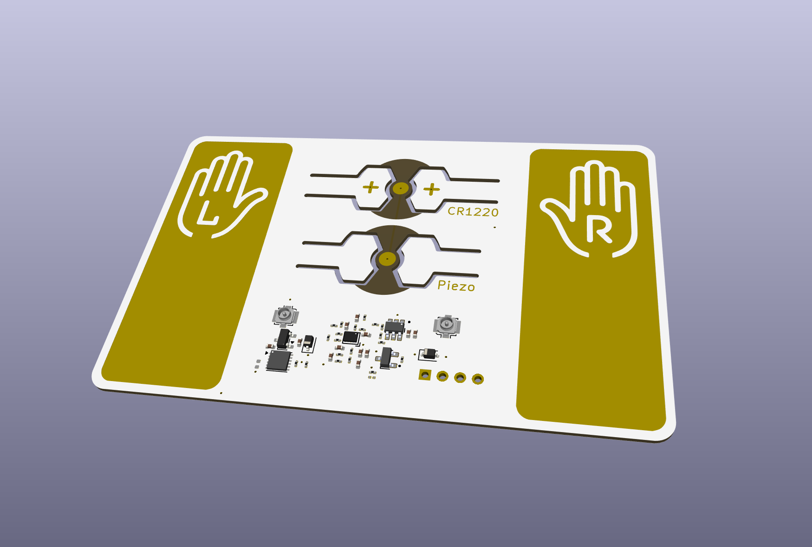
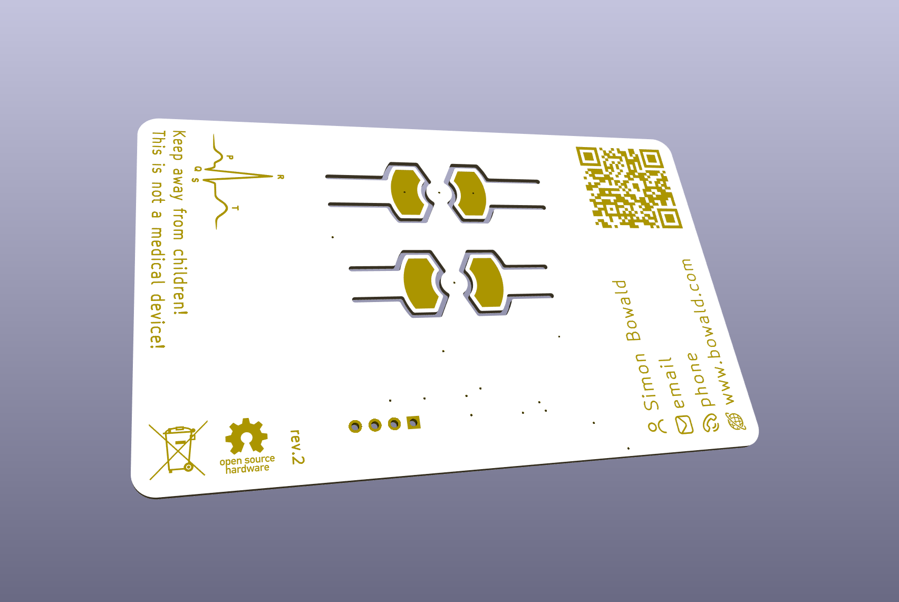

# ECG PCB Business Card

## Table of contents

- [ECG PCB Business Card](#ecg-pcb-business-card)
  - [Intended use / disclaimer](#intended-use--disclaimer)
  - [Battery safety](#battery-safety)
  - [What the card does](#what-the-card-does)
  - [Compatibility (important)](#compatibility-important)
  - [Quick start (battery recommended)](#quick-start-battery-recommended)
  - [How to hold it (signal quality)](#how-to-hold-it-signal-quality)
  - [Powering via NFC energy harvesting (Android only)](#powering-via-nfc-energy-harvesting-android-only)
  - [What you should see](#what-you-should-see)
  - [Files & documentation](#files--documentation)
    - [Project structure](#project-structure)
    - [Running the web app locally](#running-the-web-app-locally)
  - [Quick troubleshooting](#quick-troubleshooting)
  - [Measurement / lab notes](#measurement--lab-notes)
  - [Key ICs used](#key-ics-used)
  - [License](#license)

Educational demo: a functional single-lead ECG front end on a business-card-sized PCB.  
It streams the signal to your phone or computer using frequency-modulated ultrasound, decoded in a browser-based web app.

Goal: power it up, open the web app, and see a clean ECG-like waveform within about a minute, without any special lab setup.

---

## Intended use / disclaimer

**This is a DIY educational demo and not a medical device.**  
It is not intended for diagnosis, monitoring, or clinical decisions.

---

## Battery safety

The CR1220 coin cell may be outside of its original packaging. Coin cell batteries are hazardous if swallowed, so **keep them away from children at all times**.

---

## What the card does

- Measures a single-lead ECG using the built-in left/right finger pads
- Streams the signal to a web application via **ultrasound** (microphone permission required)
- Power options:
  - **Battery (recommended)**
  - **NFC energy harvesting (Android only)**

---

## Compatibility (important)

- **iOS:** works best with **Safari**
- **Android:** works best with **Chrome**
- **NFC energy harvesting:** works **only on Android**
  - iOS does not provide a reliable continuous NFC power mode for this use
- If powering via NFC energy harvesting, the phone **must not be charging** (unplug it)

---

## Quick start (battery recommended)

1. **Insert a 3 V CR1220 battery** (rated for at least **500 µA continuous load**).  
   Ensure the **+ (positive) side** faces the same direction as the **+** symbols on the PCB.  
   Do not bend the arms of the PCB battery holder more than necessary.  
   Idle current is **below 1 µA**, so the battery can be left in the holder.

2. **Open the web app**
   - Easiest: tap the phone to the card to open the link (NFC enabled + phone unlocked)
   - Scan the printed QR code
   - Or run locally (see **Files & documentation** below)

3. **In the web application**
   - Press **Start**
   - Allow **microphone access** when prompted

---

## How to hold it (signal quality)

- Place the phone/laptop on a table and rest your elbows to reduce motion.
- Hold the card firmly and press your thumbs onto the pads:
  - Left thumb on the pad marked with the hand icon and **“L”**
  - Right thumb on the pad marked with the hand icon and **“R”**
- Stay still and relax your hands and shoulders (movement causes artifacts).
- Keep the phone close to the card so the microphone picks up the signal reliably.
- Use a quiet room if possible (avoid talking, music, fans, strong background noise).
- Avoid Bluetooth headsets so the browser uses the built-in microphone.

---

## Powering via NFC energy harvesting (Android only)

Use this when you want a “no battery” demo. It is more sensitive to positioning.

1. Make sure the phone is **not charging** (unplug it).
2. Place the card on the **back of the phone**, centered over the phone’s **NFC coil** area.
3. Flip the card upside down as needed so Left/Right orientation is correct while it sits on the phone.
4. Press fingers on the same **L** and **R** pads as in battery mode.
5. If your phone has a metal frame/back, avoid touching metal parts while contacting the pads.

---

## What you should see

You should see a waveform similar to the example printed on the back of the card (above “Keep away from children.”).

If the signal looks noisy or flat, it is almost always due to:
- Contact pressure
- Hand motion
- Dry skin
- NFC positioning (in harvesting mode)

---

## Files & documentation

### Project structure

- `hardware/ECG_Business_Card_v3/`  
  KiCad project (schematic + PCB), plus manufacturing outputs and documentation assets.
- `web/`  
  Browser-based decoder and viewer (`ecg.html`, `script.js`, `style.css`).

### Running the web app locally

Open `web/ecg.html` in your browser.  

---

## Quick troubleshooting

### No signal / flat line
- Confirm battery orientation (+ matches PCB)
- Press **Start**
- Ensure the browser has **microphone permission**
- Keep the phone very close and ensure it uses the **built-in mic** (disconnect Bluetooth devices)
- Audio sanity check: clapping near the phone should cause a visible change in the signal

### Very noisy signal
- Stay still, increase thumb pressure slightly, relax shoulders
- Try a quieter room
- Dry skin reduces contact: slightly moist fingertips can help
- Avoid touching metal parts of the phone while contacting the pads

### NFC power issues (Android)
- Phone must be unplugged (not charging)
- Align the card over the NFC coil and try small position shifts
- Remove thick cases

---

## Measurement / lab notes

If you do scope/DAQ measurements on the card, the cleanest approach is to use a **battery-powered** measurement device.

---

## Key ICs used

- **:contentReference[oaicite:0]{index=0} AD8233** – Single-lead ECG analog front end (instrumentation amp + filters) used to acquire the ECG signal from the finger pads.
- **:contentReference[oaicite:1]{index=1} LTC6990** – Timer/VCO used to generate the FM ultrasound carrier/modulation for audio-band transmission.
- **:contentReference[oaicite:2]{index=2} ST25DV** (ST25DVxxK series) – NFC tag used for tap-to-open link and NFC energy harvesting support (Android).

---

## License

See `LICENSE`.
